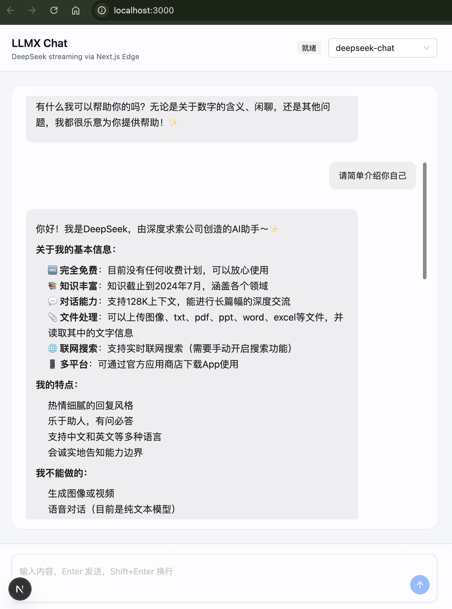

# LLMX

开箱即用的 Next.js 15 + Ant Design X 全栈 AI 对话模板，内置 DeepSeek SSE 透传、流式 Markdown 渲染、Abort 停止生成、会话存储与基础安全控制。可作为前端或全栈项目的模板起点。



## 快速开始

```bash
pnpm install
pnpm dev
```

打开 `http://localhost:3000`。

## 目录

- `src/app/api/chat/route.ts` DeepSeek SSE 透传（Edge Runtime）
- `src/app/api/history/route.ts` 会话存储（Node Runtime）
- `src/components/ChatClient.tsx` 前端聊天 UI
- `src/store/model.ts` Zustand 模型状态
- `src/lib/markdown.ts` Markdown 渲染

## 特性

- Next.js 15 App Router + Edge Runtime
- DeepSeek SSE 透传（Web Streams API）
- Ant Design X（Bubble / Sender / Welcome）
- useXChat 状态管理（@ant-design/x-sdk）
- Tailwind CSS 布局
- 流式 Markdown + 代码高亮
- AbortController 停止生成
- Zustand 管理模型 ID
- 会话存储（localStorage / 文件型数据库）
- 成本与安全控制（限流 / 最大 tokens / 并发限制）

## 环境变量

复制 `.env.example` 为 `.env.local` 并填写：

```bash
DEEPSEEK_API_KEY=your_deepseek_key
DEEPSEEK_BASE_URL=https://api.deepseek.com
DEEPSEEK_MODEL=deepseek-chat

APP_API_KEY=dev-secret
AUTH_BYPASS=true

NEXT_PUBLIC_APP_API_KEY=dev-secret
NEXT_PUBLIC_DEFAULT_MODEL=deepseek-chat
NEXT_PUBLIC_MODEL_OPTIONS=deepseek-chat,deepseek-reasoner
NEXT_PUBLIC_SESSION_STORAGE=local

SESSION_DB_PATH=.data
MAX_STORED_MESSAGES=200

RATE_LIMIT_WINDOW_MS=60000
RATE_LIMIT_MAX=60
CONCURRENCY_MAX=2
MAX_INPUT_CHARS=20000
MAX_COMPLETION_TOKENS=1024
```

- `AUTH_BYPASS=true` 仅建议开发阶段使用。
- 生产环境请设置 `APP_API_KEY` 并移除 `AUTH_BYPASS`。

## 会话存储

- `NEXT_PUBLIC_SESSION_STORAGE=local` 使用 localStorage 存储会话。
- `NEXT_PUBLIC_SESSION_STORAGE=db` 使用文件型会话存储（Node Runtime），对应接口 `src/app/api/history/route.ts`。
- `SESSION_DB_PATH` 指定文件存储目录，默认 `.data`。
- 文件型存储适合本地开发，生产环境建议替换为真正数据库。

## 成本与安全控制

- `RATE_LIMIT_WINDOW_MS` / `RATE_LIMIT_MAX` 简单限流（按 IP）。
- `CONCURRENCY_MAX` 并发限制（按 IP）。
- `MAX_INPUT_CHARS` 输入字符数限制。
- `MAX_COMPLETION_TOKENS` 输出 token 上限。

## 构建

```bash
pnpm build
pnpm start
```

## 部署（Vercel / Edge Function）

1. 在 Vercel 新建项目，选择该仓库。
2. 设置环境变量：`DEEPSEEK_API_KEY`、`APP_API_KEY`、`AUTH_BYPASS=false`，以及可选的限流与会话存储配置。
3. 部署后 `/api/chat` 为 Edge Runtime；`/api/history` 为 Node Runtime。
4. 前端通过 `NEXT_PUBLIC_APP_API_KEY` 携带鉴权头访问服务端。

## 文档

- `docs/overview.md` 架构与数据流
- `docs/config.md` 配置说明
- `docs/deployment.md` 部署指南
- `docs/security.md` 安全与成本控制
- `docs/faq.md` 常见问题
- `docs/extension.md` 扩展指南

## License

MIT
